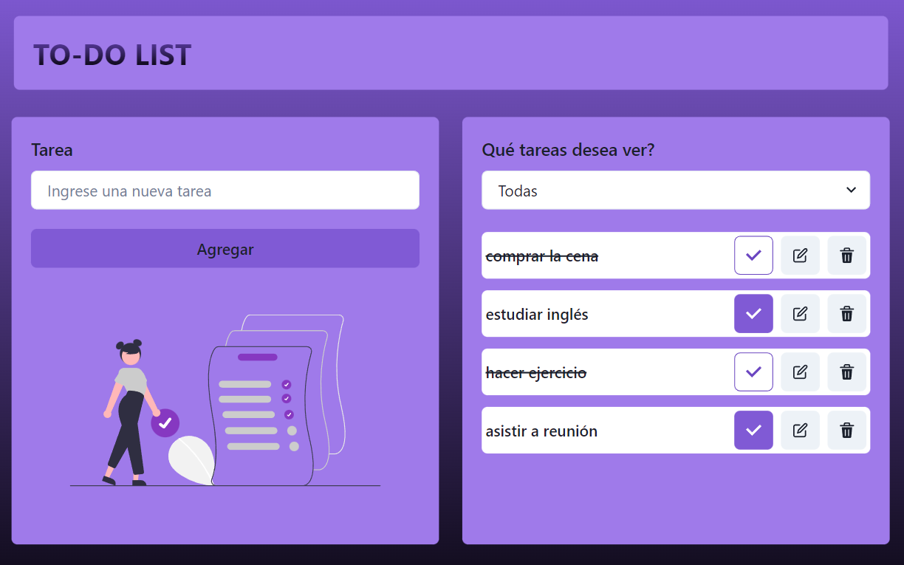

## To Do List

Esta app te permite crear una lista de tareas, que te ayudará a tener más organizada tu vida cotidana, laboral o académica, de esta manera podrás ser más productivo y no te olvidarás de tareas pendientes. 
Podrás crearlas, editarlas, marcar las que completaste o eliminarlas muy facilmente. También tendrás la opción de elegir que tipo de tareas deseas visualizar: completas, incompletas o todas.

## Herramientas utilizadas

Creada con `Vite` utilizando `React` y la bibliteca `Chakra UI` para su estilado.
Es totalmente responsive y cuenta con propiedades de accesibilidad.

## Instalación

1. Clonar el repositorio:

   git clone https://github.com/Silvana-Lima/TP-ToDoList.git

2. Instalar dependencias:

   npm install

3. Iniciar la aplicación:

   npm run dev

## Utilización:

1. Añade una tarea: Escribe la tarea en el campo de texto y presiona el botón "Agregar" o presiona la tecla "Enter" en el teclado.

2. Marca una tarea como completada: Haz click en el botón de "Completar" (contiene ícono check) junto a la tarea que deseas marcar como completada. Si quieres desmarcarla, haz click nuevamente y volverá a su estado inicial, "incompleta".

3. Edita una tarea: Haz click en el botón de "Editar" (contiene ícono editar) junto a la tarea que deseas cambiar. Modifica la tarea en el campo de texto y presiona el botón "Editar".

4. Elimina una tarea: Haz click en el botón de "Eliminar" (contiene ícono cesto de basura) junto a la tarea que deseas eliminar. Aparecerá una alerta para que confirmes la acción, presiona nuevamente "Eliminar" para confirmar o cancelar para volver atrás.

## Vista previa

## Link

- [Si quieres pobrar la app sin necesidad de instalarla, puedes hacerlo siguiendo este link.](https://tp-to-do-list.vercel.app/)

